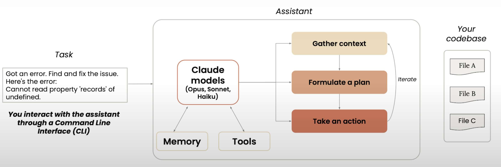
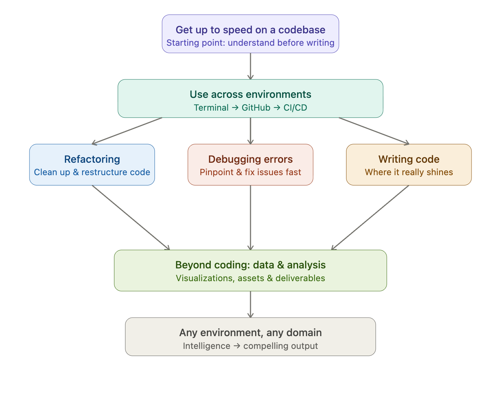
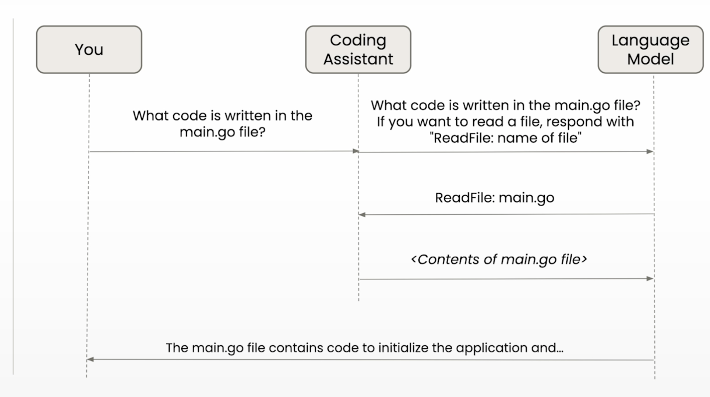

# What is Claude Code?

## Agentic System = Model+Tools+Environment+Control Loop+Memory
Claude Code **operates within an agentic system**.

| Component   | Example in Claude Code     |
| ----------- | -------------------------- |
| Model (The Reasoning Engine)      | Anthropic Claude models    |
| Tools (The Actuators)      | file system, terminal, git |
| Environment | local codebase             |
| Control     | orchestration loop         |
| Memory      | conversation + file state  |

1. **Lightweight Harness**: Claude Code is a lightweight, command-line **agentic harness** that turns the Claude model into a powerful coding agent.

2. **Tools & Environment**: The harness equips the model with tools, an environment, and supporting functionality to navigate codebases and solve complex problems more effectively than direct task assignment.

3. **Memory & Action**: The model gains memory to retain user preferences and task context, plus the ability to assess data needs, formulate plans, and take action.

##  Claude Code work as Agent

┌──────────────────────────────────────────────┐
│                User Input                    │
└──────────────────────────────────────────────┘
                        ↓
┌──────────────────────────────────────────────┐
│                 Task Parsing                 │
└──────────────────────────────────────────────┘
                        ↓
┌──────────────────────────────────────────────┐
│                 Policy  (π)                  │
│  - Tool selection                            │
│  - Task decomposition                        │
└──────────────────────────────────────────────┘
                        ↓
┌──────────────────────────────────────────────┐
│           Context Scheduler                  │
│  - Codebase retrieval                        │
│  - Skill retrieval                           │
│  - Memory retrieval                          │
│  - Token budget optimization                 │
└──────────────────────────────────────────────┘
                        ↓
┌──────────────────────────────────────────────┐
│                LLM Core                      │
│     (reasoning + tool decision)              │
└──────────────────────────────────────────────┘
                        ↓
┌──────────────────────────────────────────────┐
│         Execution Engine / Tools             │
│  - Shell                                     │
│  - Git                                       │
│  - Tests                                     │
└──────────────────────────────────────────────┘
                        ↓
┌──────────────────────────────────────────────┐
│            Observation / Feedback            │
└──────────────────────────────────────────────┘
                        ↓
                (Loop back ↑)

**Takeaway**:
- “Agent” is a behavioral abstraction
- “Agentic system” is a systems engineering abstraction
- Claude Code sits exactly at the intersection:
    - implements an agent loop
    - embedded in an agentic runtime

## Harness = (Context Builder,Tool Router,Execution Manager,State Handler)

                 +--------------------------------------+
                 |              Environment             |
                 |               (Codebase )            |
                 +------------------+-------------------+
                                    |
                                    |  observations (state, files, outputs)
                                    v
+-------------------+     +------------------------+     +------------------+
|                   |     |                        |     |                  |
|     Harness       |---->|        Model           |---->|      Tools       |
|   (Controller)    |     |  (Policy Approx π)     |     |   (Actuators)    |
|                   |<----|                        |<----|                  |
+---------+---------+     +-----------+------------+     +--------+---------+
          ^                             |                         |
          |                             | actions                 |
          |                             v                         |
          |                   +------------------+                |
          |                   |                  |                |
          +-------------------+  State / Memory  +---------------+
                              | (Internal State) |
                              +------------------+

[Harness Engineering Is Cybernetics](https://x.com/odysseus0z/status/2030416758138634583): a closed-loop control system with an LLM as the policy core.

The harder problem is **calibrating the sensor and actuator with system-specific knowledge**.
Human-in-the-loop calibration:
- Calibrating the Actuator (**Execution Boundaries**): Define strict permissions, structural guardrails, and operating constraints for what & how the agent is allowed to modify.
- Calibrating the Sensor (**Feedback Mechanisms**): Combine high-signal automated tests with human code review to measure **deviations** between the agent's output and expected behavior.

## Use scenarios
Claude Code can help with **every step** of your project.

## Tool use

The architectural pattern is the same as [ELEC4633
Real Time Engineering](https://www.unsw.edu.au/content/dam/pdfs/engineering/electrical-telecom-eng/course-outlines/2021-10-electrical-engineering/term-1-(and-summer-term-2021)/2021-10-ELEC4633-T1-2021-Course-Outline.pdf): a system where components communicate by passing messages and invoking actions, with a **coordinator** in the middle managing who does what.

## Claude's memory
Memory across sessions (claude.md):
- In `CLAUDE.md` files, you can define your style guidelines and common commands.
- Claude.md files get automatically loaded into Claude Code's context when launched.

Conversation history:
- Conversation history is automatically stored locally on `~/.claude/history.jsonl`.
- You can choose to clear the conversation of your current session.
- Past conversations are not automatically included in the context. You manually ask Claude Code to continue a previous conversation.

User control & extension:
- Slash Commands: Users can actively guide Claude to record or modify memory via commands like `/remember`, `/forget`, and `/summarize`.
- Memory is persisted in `CLAUDE.md` files — globally at `~/CLAUDE.md` or per-project at `./project/CLAUDE.md`. Project-level settings take priority over global ones.
- Community plugins (e.g. `claude-mem`) can further enhance local memory by auto-detecting the tech stack and storing session summaries, reducing token usage on repeated context injection.

## Claude Code Installation

To follow along with the lessons, here's how you can install Claude Code.

1. Run the following command:

    `npm install -g @anthropic-ai/claude-code`

    For more installation guides, you can find them [here](https://docs.anthropic.com/en/docs/claude-code/setup).

2. Once you have Claude Code installed, you can:
   - launch it from your terminal: navigate to your project folder & then type `claude`
   - launch it from the terminal integrated within VS Code by typing `claude`, the extension will auto-install.

    For more info, check [Claude Code IDE Integrations](https://docs.anthropic.com/en/docs/claude-code/ide-integrations).
